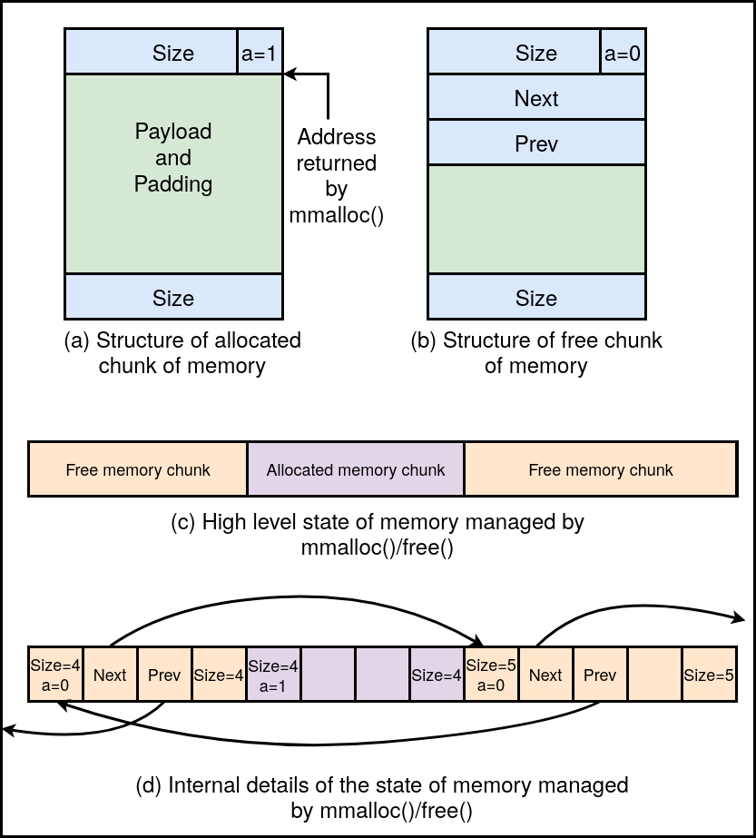

# Directory_size and Memory allocation
## Directory space usage

`my_du` is a customized version of the `du` command, tailored for Linux systems. It provides the size of a directory, including its files, sub-directories, the directory itself, and the symbolic link file size, if any.

## Key Features

1. **Comprehensive Size Calculation:**
   - The size calculation includes the total size of files, sub-directories, and the directory itself.
   - Symbolic link file sizes are considered in the calculation, assuming they do not point to the same directory being analyzed, and there are no loops.

2. **Forked Process Architecture:**
   - The program utilizes the fork system call to create a child process for each immediate sub-directory.
   - Each child process independently calculates the size of its assigned directory and communicates the result to the parent process.

3. **Efficient Communication using Pipes:**
   - Communication between the parent and child processes is established through pipes.
   - A single pipe is used for efficient data exchange.

4. **Handling Symbolic Links:**
   - Symbolic links are managed by the parent process.
   - The program ensures that symbolic links do not lead to the same directory under consideration, preventing potential loops.

## How to Run

1. **Compilation:**
   - Compile the program using the following command:

     ```bash
     gcc -o my_du my_du.c
     ```

2. **Execution:**
   - Run the program with the desired relative path to the directory you want to analyze:

     ```bash
     ./my_du <relative path to the directory>
     ```

Replace `<relative path to the directory>` with the actual path you want to analyze.

Note: Ensure that the program has the necessary permissions to access the specified directory.

Feel free to explore the program and contribute to its improvement. If you encounter any issues or have suggestions, consider opening an issue or submitting a pull request.

## Dynamic Memory Management Implementation

This project implements a custom dynamic memory allocation library, offering functionalities similar to `malloc()` and `free()`. It provides users with the ability to dynamically allocate and free memory in a flexible and efficient manner.

### Key Features

1. **Memory Allocation:**
   - The `memalloc()` function allows users to dynamically allocate memory.
   - The syntax for `memalloc()` is as follows:

     ```c
     void *memalloc(unsigned long size);
     ```

   - `size`: A single argument of type `unsigned long` specifying the amount of memory requested in bytes.
   - If the requested size is 0 or if the allocation request cannot be satisfied, `memalloc()` returns `NULL`.
   - For requests larger than 4 MB, the implementation requests the smallest multiple of 4 MB from the operating system using `mmap()`.

2. **Memory Deallocation:**
   - The `memfree()` function allows users to free previously allocated memory.
   - The syntax for `memfree()` is as follows:

     ```c
     int memfree(void *ptr);
     ```

   - `ptr`: A pointer to the memory allocated by `memalloc()` that is to be freed.
   - The function returns `0` on success.
   - Handles various cases during deallocation, including coalescing and merging adjacent free memory chunks.

3. **Metadata Maintenance:**
   - Metadata is maintained to handle allocation and deallocation requests efficiently.
   - Ensures that free memory chunks are appropriately sized to serve future memory allocation requests.
   -  See the accompanying image for a visual representation of the metadata maintenance corresponding to the allocated and free memory chunks.

   
   
   
   *Caption: Example to illustrate the metadata maintenance corresponding to the allocated and free memory chunks.*

### How to Use

1. **Compilation:**
   - Compile the library using the following command:

     ```bash
     gcc -o mylib mylib.c
     ```

2. **Include Header:**
   - Include the library header in your program:

     ```c
     #include "mylib.h"
     ```

3. **Usage:**
   - Use `memalloc()` to allocate memory and `memfree()` to deallocate memory.

     ```c
     void *ptr = memalloc(100); // Allocate 100 bytes
     // Use the allocated memory
     memfree(ptr); // Free the allocated memory
     ```


### Error Handling

- In case of any error during `memalloc()`, it returns `NULL`.
- In case of any error during `memfree()`, it returns `-1`.

Feel free to explore and contribute to the improvement of this dynamic memory management system. If you encounter any issues or have suggestions, consider opening an issue or submitting a pull request.
